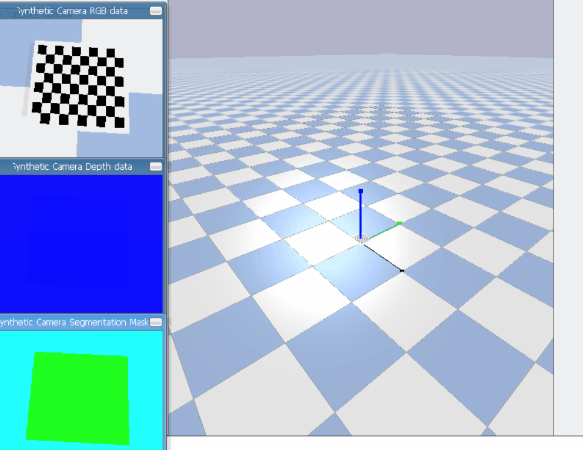
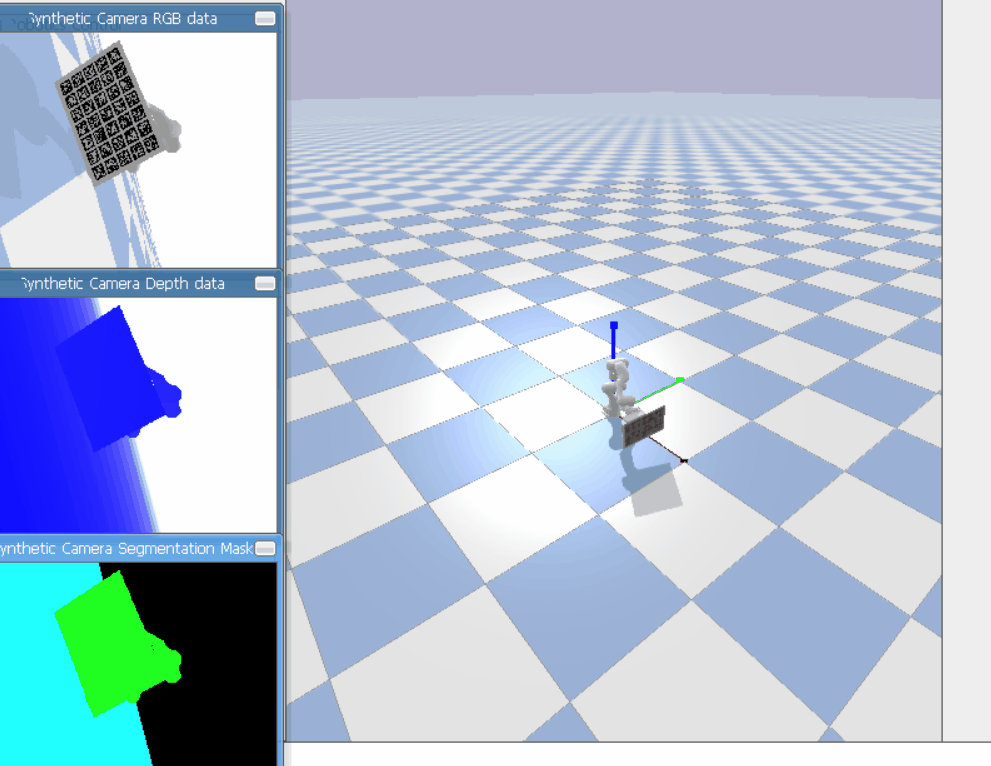

This repository is mainly for camera intrinsic and extrinsic calibration 


Synthetic experiments are conducted in [PyBullet](https://pybullet.org) simulator.

#### 1. special opencv
```
pip install opencv-contrib-python==4.6.0.66
```

#### 2. intrinsic calibration
```
python example_intrinsic.py
```



#### 3. extrinsic calibration
```
python example_extrinsic.py
```



#### 4. generate aruco
```
python generate_aruco.py
```


#### Note

+ The implementation of hand-eye calibration is based on 

https://github.com/zhiyuanyou/Calibration-ZhangZhengyou-Method

https://github.com/caijunhao/calibration
    

+ Some useful links are listed below:

[How to decide on which ArUco marker dictionary you want to use?](https://www.pyimagesearch.com/2020/12/14/generating-aruco-markers-with-opencv-and-python/)

[Chessboard Generator](https://eleif.net/checker.html)

[A brief introduction of hand-eye calibration by TUM](http://campar.in.tum.de/Chair/HandEyeCalibration)

